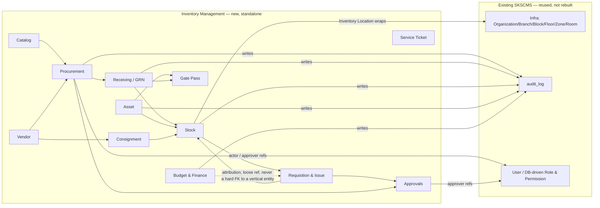
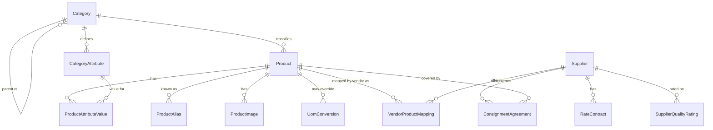
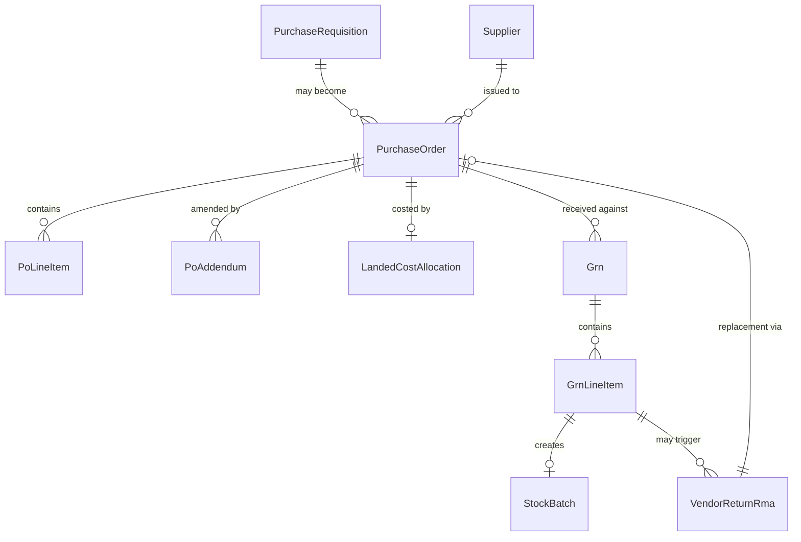
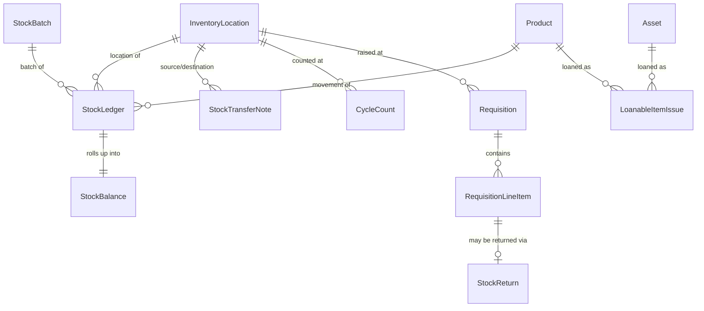
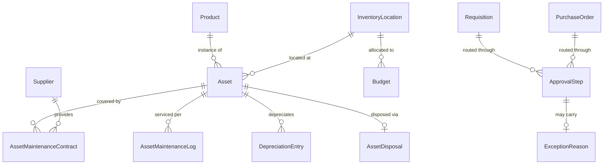
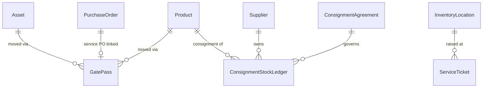

# Inventory Management — Core ER Diagram & Module Boundaries

> Draft v0.1 — first pass at the entity model and bounded contexts, derived from [`CORE_REQUIREMENTS_AND_GAP_ANALYSIS.md`](CORE_REQUIREMENTS_AND_GAP_ANALYSIS.md) §6 and every decision in [`DECISION_LOG.md`](DECISION_LOG.md). Not formally signed off by the business team, but implementation began against it 2026-09-07 per user direction — see `DECISION_LOG.md`'s "Phase 1 kickoff" entry. §2's `Category`, `Uom`, `Product`, and `CategoryAttribute`, and §4's `InventoryLocation`, `StockBatch`, `StockLedger`, and `StockBalance` are now built (with small deliberate deviations logged in `DECISION_LOG.md`: `Uom`'s primary key, `CategoryAttribute`'s nested-under-Category permission model, `ProductImage` deferred, `InventoryLocation` is Room-only with a real FK rather than the polymorphic Zone/Room reference, and only `RECEIPT`/`ADJUSTMENT`/`DISPOSAL` movement types are wired up); the rest of this draft still awaits review before being built against.

## 0. What This Reuses vs. Builds New

Before any new entity, this codebase was checked for something that already does the job — the same discipline that found the Infra hierarchy. Three findings shape everything below:

| Concern | Finding | Consequence |
|---|---|---|
| **Physical locations** | `Organization → Branch → Block → Floor → Zone → Room` already exists (`backend/src/main/java/com/cms/model/{Organization,Branch,Block,Floor,Zone,Room}.java`), documented as generic/shared. | Inventory Location wraps an existing `Room` (occasionally `Zone`) — no new location hierarchy. |
| **Audit trail** | A generic `AuditLog` entity/table already exists (`audit_log`, migration `V90__create_audit_log.sql`: `actor, action, entityType, entityId, detail, occurredAt`), currently used for role/permission/user changes. | Inventory **reuses this table** — every module writes rows with its own `entityType` (`"PurchaseOrder"`, `"Grn"`, `"StockLedger"`, `"Asset"`, …) instead of building a parallel audit table. No new `AuditLog` entity in this document. |
| **"Department" concept** | An entity named `Department` exists only as a two-line redirect stub — the real entity is `Speciality` (`name, code, description, hodFacultyId, hodName, isActive`). **This is not a safe generic reuse target**: it's an academic-program concept tied to a Faculty HOD, which is exactly the kind of vertical-flavoured naming the module must not depend on (see `DECISION_LOG.md`'s "no vertical branding" entry). | Nowhere in this model does Inventory take a hard FK to `Speciality`. Cost attribution (§5) uses a loose, generic reference instead, which *can* point at `Speciality` in a college deployment or at a hospital's own department table, without Inventory's schema ever naming either. |

---

## 1. Module Boundaries (Bounded Contexts)

**Logical boundary, not (yet) a physical one.** These twelve are *bounded contexts* — cohesive groups of entities and the operations on them — not a commitment to Gradle sub-modules or separate deployables. Per `DECISION_LOG.md`'s "extraction approach: explicitly deferred" entry, whether this becomes a true multi-module build, a package-namespace convention only, or a runtime-profile toggle is **still open**. What *is* settled, and reflected here: new code should live under a package namespace scoped to its bounded context (e.g., `com.cms.inventory.catalog`, `com.cms.inventory.procurement`, …) rather than the flat `com.cms.model`/`com.cms.service` structure the rest of the app uses today — this is free to do now and doesn't foreclose either extraction path later.

---

## 2. Catalog & Vendor

| Entity | Key Attributes | Notes |
|---|---|---|
| **Category** | CategoryId (PK), Name, ParentCategoryId (self-FK, nullable), IsActive | Hierarchical; drives which `CategoryAttribute`s a Product of that category carries — closes GAP-20 |
| **CategoryAttribute** | AttributeId (PK), CategoryId (FK), Name, DataType [Text/Number/Date/Boolean/Enum], IsRequired, DisplayOrder | E.g. "Shelf Life" for a pharma category, "ISBN" for a library-book category, "Calibration Due" for a lab-instrument category — never hard-coded columns per vertical |
| **Product** | ProductId (PK), ProductCode, ProductName, CategoryId (FK), BaseUomId (FK→Uom), ReorderLevel, ReorderQty, IsAsset, IsConsumable, IsService, IsLoanable, DepreciationRate, WarrantyPeriodMonths, IsActive | `IsLoanable` (new vs. SRS) flags a product eligible for `LoanableItemIssue` (§6) |
| **ProductAlias** | AliasId (PK), ProductId (FK), AliasName | Same item known by different names across locations (SRS REQ-I002) |
| **ProductAttributeValue** | ValueId (PK), ProductId (FK), AttributeId (FK), Value | The EAV-style value row for a `CategoryAttribute` |
| **ProductImage** | ImageId (PK), ProductId (FK), Url, IsPrimary | |
| **Uom** | UomCode (PK), Name | e.g. EA, BOX10, KG, LTR |
| **UomConversion** | ConversionId (PK), ProductId (FK, nullable = global rule), FromUomId (FK), ToUomId (FK), ConversionFactor | Closes GAP-12 |
| **VendorProductMapping** | MappingId (PK), SupplierId (FK), ProductId (FK), VendorProductCode, VendorProductName, Rate, TaxRuleId (FK→TaxRule, §6), HsnOrTaxClassCode, EffectiveDate, ExpiryDate, IsApproved | `HsnOrTaxClassCode` generalizes the SRS's India-only `HsnCode` |
| **Supplier** | SupplierId (PK), SupplierCode, SupplierName, TaxRegistrationId, LegalRegistrationNo, BankAccountRef, ContactPerson, Email, Phone, IsApproved, ApprovalDate, PortalAccessEnabled | `TaxRegistrationId`/`LegalRegistrationNo` generalize GSTIN/PAN (GAP-02) |
| **RateContract** | ContractId (PK), SupplierId (FK), StartDate, EndDate, ContractValueCap, TermsText, IsActive, RenewalReminderDate | |
| **SupplierQualityRating** | RatingId (PK), SupplierId (FK), ProductId (FK, nullable), RatedByLocationId (FK→InventoryLocation), RatingValue, Feedback, RatedDate | |
| **ConsignmentAgreement** | AgreementId (PK), SupplierId (FK), ConsignmentCap, ReplenishmentTrigger, BillingCycle, StartDate, EndDate, PricingTerms, IsActive | Promoted to its own entity — closes GAP-23. Products in scope via a join table (`ConsignmentAgreementProduct`, ProductId+AgreementId) omitted from the diagram for brevity. |

---

## 3. Procurement & Receiving

| Entity | Key Attributes | Notes |
|---|---|---|
| **PurchaseRequisition** | PrId (PK), PrNumber, PrDate, LocationId (FK→InventoryLocation), RequestedBy (FK→User), Status, TotalEstimatedValue | The SRS's own flow diagram shows this step but its data model (§6.1) never names it as an entity — added here for a real PR→PO trail |
| **PurchaseOrder** | PoId (PK), PoNumber, PoDate, SupplierId (FK), LocationId (FK), RequestedBy, TotalValue, CurrencyCode, ExchangeRate, Status, RateContractId (FK, nullable), SourceType [Standard/Marketplace/Cash/Spot], IsUrgent | `IsCashPo` folded into `SourceType='Cash'` rather than a separate boolean, closing GAP-25's ambiguity |
| **PoLineItem** | LineId (PK), PoId (FK), ProductId (FK), Qty, UnitRate, TaxRuleId (FK), Discount, LineTotal, ExpectedBatchNo, ExpectedExpiryDate, DeliveryDate | |
| **PoAddendum** | AddendumId (PK), PoId (FK), AddendumType, Description, Amount, ApprovedBy, ApprovedDate | |
| **LandedCostAllocation** | AllocationId (PK), PoId (FK), TotalLandedCost, ApportionmentBasis [Value/Qty/Weight] | |
| **Grn** | GrnId (PK), GrnNumber, GrnDate, SupplierId (FK), PoId (FK, nullable — cash/spot GRNs may precede a formal PO), InvoiceNo, InvoiceDate, DcNo, DcDate, TotalGross, TotalTax, GrandTotal, Status, ReceivedBy, LocationId (FK), IsCashGrn | `IsCashGrn` closes GAP-25 |
| **GrnLineItem** | GrnLineId (PK), GrnId (FK), ProductId (FK), QtyReceived, UnitRate, StockBatchId (FK, created at receipt), Mrp | |
| **VendorReturnRma** | RmaId (PK), GrnLineId (FK), Reason, Qty, DebitNoteRef, ReplacementPoId (FK, nullable), Status | Closes GAP-11 — distinct from the internal `StockReturn` in §4 |

---

## 4. Stock, Location & Requisition

| Entity | Key Attributes | Notes |
|---|---|---|
| **InventoryLocation** | LocationId (PK), InfraNodeType [Room/Zone], InfraNodeId (FK → existing `Room`/`Zone`), VirtualName, LocationRole [Store/RequestingPoint/Both], IsActive | Replaces the SRS's flat Location Master — closes GAP-10. `VirtualName` is exactly the "virtual name" the user described for Infra nodes used by Inventory. |
| **StockBatch** | BatchId (PK), ProductId (FK), BatchOrSerialNo, ExpiryDate (nullable), ReceiptCost, GrnLineId (FK, nullable), IsConsignment | |
| **StockLedger** | LedgerId (PK), ProductId (FK), LocationId (FK), BatchId (FK, nullable), TxnType [Receipt/Issue/Transfer/Adjustment/Return/ConsignmentConsumption/Disposal], QtyDelta, UnitCost, RefType, RefId, TxnDate, PerformedBy | Append-only source of truth — closes GAP-07. Never updated or deleted, only appended. |
| **StockBalance** | BalanceId (PK), ProductId (FK), LocationId (FK), BatchId (FK, nullable), QtyOnHand, ValueOnHand, LastUpdated | Materialized/derived, kept in sync on every `StockLedger` write — per the Backend Architect decision (`DECISION_LOG.md`) |
| **StockTransferNote** | TransferId (PK), TransferNumber, SourceLocationId (FK), DestinationLocationId (FK), ProductId (FK), Qty, Status [Requested/InTransit/Received], RequestedBy, ApprovedBy | |
| **CycleCount** | CountId (PK), LocationId (FK), ScheduleType, CountDate, CountedQty, SystemQty, VarianceApprovedBy, Status | Closes GAP-09 — the SRS never modelled this beyond a diagram box |
| **Requisition** | RequisitionId (PK), RequisitionNumber, RequisitionDate, LocationId (FK), RequestedBy, ApprovedBy, Status, IsAutoGenerated, IsEmergency, ReasonForRequirement | Generic name for the SRS's "ward request"/"indent" |
| **RequisitionLineItem** | LineId (PK), RequisitionId (FK), ProductId (FK), RequestedQty, IssuedQty, IssueDate, IssuedBy, StockLedgerRefId (FK, nullable), Status, **ChargeableCostObjectType** (nullable, free string set per deployment — e.g. `"Patient"`, `"Student"`, `"Account"`, `"WorkOrder"`), **ChargeableCostObjectId** (nullable, external reference, no FK) | The two `Chargeable*` columns are the generic, loose stand-in for the SRS's hard-coded Patient ID billing link — deliberately **not** a foreign key to any specific table (not `Speciality`, not a hospital's patient table), so the core never depends on a vertical-specific schema. A deployment's own integration layer resolves the reference. |
| **StockReturn** | ReturnId (PK), RequisitionLineId (FK, nullable), ReturnReason [NotOfUse/Excess/Expiry/Damaged], Qty, ReturnValue, RequesterId | Internal return — distinct from `VendorReturnRma` |
| **LoanableItemIssue** | LoanId (PK), ProductId (FK, nullable) or AssetId (FK, nullable — exactly one set), PersonId (FK→User), IssueDate, DueDate, DepositAmount, ReturnDate, ConditionOnReturn, FineAmount, Status | Closes GAP-26/GAP-28 — one generic loan/return type for Library (deferred consumer), Sports, Hostel |

---

## 5. Asset, Budget & Approvals

| Entity | Key Attributes | Notes |
|---|---|---|
| **Asset** | AssetId (PK), AssetCode, ProductId (FK), SerialNo, PurchaseDate, WarrantyStart, WarrantyEnd, LocationId (FK), Status [Active/InUse/UnderMaintenance/Idle/RedTag/Scrap/Sold], BookValue, AccumulatedDepreciation | |
| **AssetMaintenanceContract** | ContractId (PK), AssetId (FK), ContractType [AMC/CMC], SupplierId (FK), StartDate, EndDate, Value, CoverageDetails, ResponseTimeSla | `ContractType` labels kept as AMC/CMC (industry-standard maintenance-contract terms, not hospital-specific — see §4 renaming table in the core doc) |
| **AssetMaintenanceLog** | LogId (PK), AssetId (FK), MaintenanceType, ScheduleDate, CompletionDate, PerformedBy, Cost, NextDueDate, Status | |
| **DepreciationEntry** | EntryId (PK), AssetId (FK), Period, OpeningWdv, DepreciationAmount, ClosingWdv, PostedToLedger (bool — via `LedgerConnectorConfig`) | |
| **AssetDisposal** | DisposalId (PK), AssetId (FK), DisposalType [Scrap/Sold/RedTag], Reason, ApprovedBy, SaleValue, BuyerDetails, DisposalCertificateRef | |
| **Budget** | BudgetId (PK), LocationId (FK→InventoryLocation, nullable), **CostAttributionType** (nullable, e.g. `"Speciality"`, `"HospitalDepartment"`, free per deployment), **CostAttributionId** (nullable, external reference, no FK), PeriodType [FiscalYear/AcademicYear/Semester/Term], PeriodValue, CategoryId (FK→Category, nullable), AllocatedAmount, SpentAmount, CarryForward, IsFrozen | `PeriodType` closes GAP-27. `CostAttribution*` is the same loose-reference pattern as `RequisitionLineItem`'s `Chargeable*` fields — deliberately not an FK to `Speciality` or any vertical-specific department table |
| **TaxRule** | RuleId (PK), Region, RateType, Rate, InclusiveFlag, ExemptionRef | Closes GAP-02 |
| **LedgerConnectorConfig** | ConnectorId (PK), ConnectorType [Tally/QuickBooks/SAP/None], MappingConfig, IsActive | Interface built now; only a no-op/`None` default shipped in this phase, Tally adapter deferred (per Backend Architect decision) |
| **SupplierOutstandingReconciliation** | ReconciliationId (PK), SupplierId (FK), Period, SystemBalance, VendorConfirmedBalance, VarianceStatus | |
| **ApprovalStep** | StepId (PK), TransactionType, TransactionId, ApproverLevel, ApproverId (FK→User), Action, ActionDate, Comments, DelegatedFrom, StepType [Sequential/Parallel], QuorumRule | Generic across every transaction type (PR, PO, Requisition, Asset disposal, …) via `TransactionType`+`TransactionId` |
| **ApproverMatrix** | MatrixId (PK), Role, LocationScope (FK→InventoryLocation, nullable = all), ValueLimit, Category (FK→Category, nullable) | Config, not a transaction |
| **ExceptionReason** | ExceptionId (PK), TransactionType, TransactionId, ExceptionType, ReasonCode, FreeText, ApprovingAuthority | |

---

## 6. Gate Pass, Consignment & Service Ticket

| Entity | Key Attributes | Notes |
|---|---|---|
| **GatePass** | GatePassId (PK), GatePassNumber, Direction [Outward/Inward], ReturnableFlag, ProductId (FK, nullable) or AssetId (FK, nullable), Qty, Reason, LinkedServicePoId (FK, nullable), ExpectedReturnDate, Status, ApprovedBy, SecurityVerifiedBy | |
| **ConsignmentStockLedger** | ConsignmentLedgerId (PK), SupplierId (FK), AgreementId (FK), ProductId (FK), QtyOnHand, ConsignmentPrice, ReceiptDate, ConsumedQty, OwnershipTransferDate, BillingCycleStatus | Consumption still posts to the main `StockLedger` too (§4) — this table is the vendor-ownership side-ledger only |
| **ServiceTicket** | TicketId (PK), TicketNumber, TicketDate, LocationId (FK), RequestedBy, Category, Priority, Status, AssignedTo, ResolutionDate, FeedbackRating | Generic service/complaint ticketing — no hospital/college-specific category hard-coded; `Category` is a configurable lookup |

---

## 7. `InventoryItem` Migration Mapping (Decision 4 — Library explicitly excluded)

Per `DECISION_LOG.md`, only `InventoryItem` (`backend/src/main/java/com/cms/model/InventoryItem.java`) migrates in this phase. Concrete field mapping, for the Backend Architect to draft the actual migration from (DBA reviews before it's written, per the DBA round decision):

| `InventoryItem` (old) | New core field | Notes |
|---|---|---|
| `id` | `Product.ProductId` (new row) + a `StockBalance` row | Splits into catalog identity vs. stock quantity — the old table conflated the two |
| `name` | `Product.ProductName` | |
| `itemCode` | `Product.ProductCode` | |
| `lab` (FK → `Lab`) | `InventoryLocation.InfraNodeId` = `Lab.room.id` (InfraNodeType=`Room`) | **Confirmed 2026-09-07:** `Lab` (`backend/src/main/java/com/cms/model/Lab.java`) has a `room` field (`@ManyToOne`, `room_id` FK to `Room`), documented as "Nullable/non-unique." Non-uniqueness is fine as-is — `InventoryLocation` doesn't require one Room to map to only one location, so two Labs sharing a physical Room each get their own `InventoryLocation` row (distinct `VirtualName`) pointing at the same `Room`. **Nullability is the real blocker**: any `Lab` with `room = null` (legacy labs still only carrying free-text `building`/`roomNumber`) has no Infra node to attach an `InventoryLocation` to. **Precondition before this migration is written:** query production/staging for `SELECT count(*) FROM labs WHERE room_id IS NULL` — if non-zero, those Labs need their `room_id` backfilled (a Campus Infrastructure data-entry task, not an Inventory-schema change) before their `InventoryItem` rows can migrate; this was not queryable from source code alone in this session. |
| `quantity` | `StockBalance.QtyOnHand` (and a corresponding opening-balance `StockLedger` entry, `TxnType='Adjustment'`, so the migration itself is auditable) | Never write `StockBalance` without a `StockLedger` row backing it — breaks the append-only-source-of-truth principle otherwise |
| `minimumQuantity` | `Product.ReorderLevel` | |
| `unit` | `Product.BaseUomId` (resolved against the new `Uom` table — free-text `unit` strings need a one-time cleanup/mapping pass to real `UomCode`s) | |
| `description` | `Product.Description` (add this column — the SRS's own Product Master doesn't currently list one either; a documentation gap worth folding in here since it's a one-line fix) | |
| `lastRestocked` | Derivable from `StockLedger` (latest `TxnType='Receipt'` for the product/location) rather than stored redundantly | |
| `createdAt`/`updatedAt` | `Product`'s own standard audit columns | |

A category is also needed: `InventoryItem` rows become `Product`s under a new `Category` (e.g., "Lab Consumables") with whatever `CategoryAttribute`s the lab-consumables use today (none currently — the old entity has no custom fields beyond the ones mapped above).

---

## 8. Explicitly Not Modelled Here (per recorded decisions)

- **No Tenant/multi-tenant tables** — per-deployment model confirmed (Decision 1).
- **No BOM / Work Order / Sales Order tables** — manufacturing/outbound out of scope for v1 (Decision 3).
- **No Library-specific tables** — migration deferred; `LoanableItemIssue` (§4) is shaped to accept Library as a future consumer but no Library data moves in this phase.
- **No `Organization Unit` entity** — withdrawn, duplicated existing `Organization`/`Branch`.
- **No new `AuditLog` entity** — reuses existing `audit_log`.
- **No hard FK from Inventory to `Speciality` or any other vertical-specific department/patient/student table** — every such reference is the loose `Type`+`Id` pattern shown on `RequisitionLineItem` and `Budget`.

## 9. Open Items Carried Forward (unresolved, not blocking this draft)

- Code/schema extraction boundary for the eventual standalone Infra+Inventory build — see `DECISION_LOG.md`, still explicitly deferred.
- ~~Whether `Lab` already has a `Room` FK for the `InventoryItem.lab` mapping~~ — **resolved 2026-09-07**, see §7: it does, but a data-quality precondition (backfilling any `Lab` rows with `room_id IS NULL`) must be checked against the actual database before the migration is written.
- `LedgerConnectorConfig`'s Tally adapter — interface only in this phase, adapter deferred.
